<div align="center">


**Connect Sweetheart of Sigma Chi to any AI/LLM of your choice.** Run Luau, inspect the live game, walk the DataModel, capture remotes, drive the editor, and build custom ESPs, aimbots & auto-farms — all from just prompting AI.

`sweetheart-of-sigma-chi` · v2.1.0 · macOS 11.5+ (Big Sur)

</div>

---

## What is this

**SOSC-MCP** is the [Model Context Protocol](https://modelcontextprotocol.io) server built into Sweetheart of Sigma Chi. It hooks the app's executor bridge up to any MCP-capable AI — Claude Code, Cursor, Codex, and more — so you can ask an agent to run Luau, walk the game tree, list players, capture remotes, or write a script into the editor, and it does it live in your session and reads the results back.

Everything ships **inside the app** — there's no separate Python process, no `pip install`, no `bridge.lua` to paste. Turn the server on in **Settings → Agent Access**, flip on your client, and go.

## How it works

```mermaid
%%{init: {'theme':'base','themeVariables':{'fontFamily':'ui-monospace, SFMono-Regular, monospace','lineColor':'#a9789c','clusterBorder':'#5b4a57','clusterBkg':'transparent'}}}%%
flowchart LR
    classDef client fill:#2a2636,stroke:#8b7cf6,stroke-width:1.5px,color:#e9e6f5;
    classDef gate   fill:#3a1f2e,stroke:#e6698f,stroke-width:2px,color:#ffe9f1;
    classDef core   fill:#301b28,stroke:#e6698f,stroke-width:1.5px,color:#ffe9f1;
    classDef exec   fill:#1f2d36,stroke:#4fb0c6,stroke-width:1.5px,color:#e7f6fb;
    classDef game   fill:#20331f,stroke:#7bc86c,stroke-width:1.5px,color:#eefbe9;

    subgraph AI["ur ai agent"]
        direction TB
        C1["claude"]
        C2["glm"]
    end

    subgraph APP["sosc"]
        direction TB
        SRV["<b>MCP Server</b><br/><code>127.0.0.1:8225/mcp</code><br/>🔒 loopback + Bearer token"]
        RTR["<b>Tool Router</b><br/>41 tools"]
        BRG["<b>OpiumwareBridge</b><br/>picks api + port"]
        SRV --> RTR --> BRG
    end

    subgraph EXE["⚙️ &nbsp;executor api"]
        direction TB
        E1["Opiumware"]
        E2["Macsploit"]
        E3["Hydrogen"]
    end

    RBX(["Live Datamodel"])

    AI == "HTTP · JSON-RPC 2.0<br/>POST /mcp · Bearer &lt;token&gt;" ==> SRV
    BRG == "selected port(s)" ==> EXE
    EXE == "Luau in ⇄ results back" ==> RBX

    class C1,C2 client;
    class SRV gate;
    class RTR,BRG core;
    class E1,E2,E3 exec;
    class RBX game;
```



- The server is **embedded in the app** — no external process, no `pip install`, no bridge script. It's a JSON-RPC 2.0 endpoint over **streamable HTTP** at `POST /mcp`.
- It binds to the **loopback address only** (`127.0.0.1`), so nothing on your network can reach it, and **every request must carry `Authorization: Bearer <token>`**.
- Tool calls are dispatched to whichever api is selected in the app (`Opiumware`, `Macsploit`, or `Hydrogen`) and, for multi-instance setups, to the executor port you target. Results read straight back up the same connection.

## Setup

**1. Turn the server on**

Open the app → **Settings → Agent Access** → flip **MCP Server** on. The pane fills in with everything a client needs:

<div align="center">

</div>

- **Port** — defaults to `8225`. The dot below reads **Listening for agents on port 8225** once it's up.
- **Endpoint** — `http://127.0.0.1:8225/mcp`, ready to copy.
- **Bearer token** — masked by default; tap the 👁 to reveal. **Copy agent config** puts the full JSON block on your clipboard; **New token** rotates the credential.

> ⚠️ **Anyone with this token can run scripts on your machine. Keep it to yourself.** Rotating with **New token** re-writes every configured client automatically — just restart them.

**2. Connect your client**

The fastest path: scroll to **Agent Clients** in the same pane, find your client, and flip its switch. The app writes that client's own config file — correct shape, restart-safe merge — so you never touch JSON. Then restart the client.

One-click supported clients — flip the switch, restart, done. Don't have one yet? Grab it:

[Claude Code](https://claude.com/claude-code) · [Claude Desktop](https://claude.ai/download) · [Cursor](https://cursor.com) · [Cline](https://cline.bot) · [Codex](https://github.com/openai/codex) · [Windsurf](https://windsurf.com) · [Antigravity](https://antigravity.google) · [Kiro](https://kiro.dev) · [Kilo Code](https://kilocode.ai) · [Roo Code](https://roocode.com) · [OpenCode](https://opencode.ai) · [BLACKBOX.AI](https://www.blackbox.ai) · [Grok CLI](https://github.com/superagent-ai/grok-cli) · [Kimi Code](https://github.com/MoonshotAI)

…plus **Deep Code** and **ZCode**, which the app configures as a bundled stdio bridge / IDE plugin — nothing extra to download.

**Manual config** (any other MCP client) — use **Copy agent config** in the pane, or drop this block in, replacing the token with yours:

```json
{
  "mcpServers": {
    "sweetheart-of-sigma-chi": {
      "type": "http",
      "url": "http://127.0.0.1:8225/mcp",
      "headers": { "Authorization": "Bearer YOUR_TOKEN_HERE" }
    }
  }
}
```

**3. Confirm** — in your AI client, call **`executor_status`**. It reports the selected executor and whether a Roblox client is attached. If a client is attached, you're live.

> The port defaults to **8225** and can be changed in the Agent Access pane (the **±** stepper). Changing it re-writes every configured client. The token and port travel only over loopback.

## Tools

**41 tools**, grouped by area. Start with `executor_status`; read `get_agent_manual` for the built-in playbook.

### Connection & execution
| Tool | What it does |
|------|--------------|
| `executor_status` | Report the selected executor and whether a client is attached. **Call first.** |
| `execute_lua` | Run Lua in the attached client. Fire-and-forget. |
| `game_eval` | Run Luau, wait for completion, return its JSON value. Prefer this to verify a path. |
| `game_execute` | Run arbitrary Lua, wait for compile/runtime completion, summarize returns + new console lines. |
| `executor_api_lookup` | Look up executor globals (`getgenv`, `hookfunction`, `request`, `writefile`…) with signatures + which executors support them. |

### Game state & perception
| Tool | What it does |
|------|--------------|
| `game_info` | Place id, job id, game name, player counts, local player. |
| `game_players` | Live players: identity, team, character position, health, state, distance. |
| `game_scene` | Structured scene perception (render camera, viewport projections, nearby parts). Not a screenshot. |
| `game_search_instances` | Search the live DataModel by name, optionally filtered by class. Returns paths. |
| `game_scan_instances` | Paged snapshot of the DataModel with stable cursors + handles (60s TTL). |
| `game_tree` | List the children of a path as a tree. |
| `game_instance` | Read one instance's properties + immediate children. |
| `game_read_script` | Cache & page a live script's source (or decompile with approval). |
| `game_console` | Read recent console output (LogService history). |

### Screenshots (host-side)
| Tool | What it does |
|------|--------------|
| `game_screenshot_capabilities` | Report screenshot-global candidates without invoking them. |
| `list_roblox_windows` | List on-screen Roblox windows + their `window_id`. |
| `capture_roblox_window` | Capture one window as PNG. Requires macOS 14+, Screen Recording permission, and `confirm_capture=true`. |

### Mutations & remote capture
| Tool | What it does |
|------|--------------|
| `game_local_action` | Client-side mutation: teleport local character, schedule self-kick, spawn a tool-owned Part, destroy a local Instance (tiered confirm). |
| `remote_capture_start` | Arm an outbound namecall capture for `remote:FireServer(...)` / `:InvokeServer(...)`. |
| `remote_capture_poll` | Read decoded events from a capture session (use `next_cursor` on each poll). |
| `remote_capture_stop` | Stop a capture session immediately. |

### Utilities & settings
| Tool | What it does |
|------|--------------|
| `get_agent_manual` | Read SOSC's built-in operating manual (topics below). |
| `list_utilities` | List SOSC utility actions, aliases, and whether each downloads third-party code. |
| `run_utility` | Run a named utility: `dex`, `save_place`, `unlock_fps`, `stream_sniper`, `owl_hub`, `infinite_yield`, `remote_spy`. |
| `list_sosc_settings` | List changeable app settings with values, types, options, bounds, side effects. |
| `get_sosc_setting` | Read one allowlisted setting. |
| `set_sosc_setting` | Change one setting with strict type/enum/range validation. |

### Files (workspace / autoexec)
| Tool | What it does |
|------|--------------|
| `list_files` | List script files with sizes + modified dates. |
| `file_info` | Existence, size, modified date, line count. |
| `read_file` | Read a script file. |
| `write_file` | Create a file (protected unless `overwrite=true`; `autoexec` runs on next inject). |
| `patch_file` | Replace an exact substring inside a file. |
| `search_files` | Full-text search across a folder with line numbers. |
| `copy_script_file` | Duplicate a script without overwriting by default. |
| `delete_script_file` | Move a script to macOS Trash (recoverable). |
| `run_script_file` | Read & execute one workspace/autoexec script. |

### Editor window
| Tool | What it does |
|------|--------------|
| `list_editor_tabs` | List open tabs with titles + sizes. |
| `read_editor_tab` | Read one tab's full content. |
| `open_editor_tab` | Open a new tab pre-filled with a script and focused. |
| `open_file_in_editor` | Open an existing workspace/autoexec file in a new tab. |
| `editor_tab_action` | Act on a tab by id: select, close, duplicate, rename, replace, clear, execute, enable/disable auto-execute, close others. |

Anything without a dedicated tool is reachable through `game_execute` / `execute_lua` — the full executor API is documented via `executor_api_lookup`.

## Safety model

The server is designed so an agent can't quietly do something destructive:

- **Loopback-only + bearer token.** Binds to `127.0.0.1`; every request is authenticated. Requests from any non-local host are rejected.
- **Read-first.** `executor_status`, `list_*`, `game_info`, `game_tree`, `game_scan_instances` and friends are safe to call freely.
- **Explicit confirmation for the sharp edges.** Screenshots need `confirm_capture=true`; local mutations need `allow_mutation=true`; destroying a pre-existing instance additionally needs `allow_preexisting_destroy=true`; decompiling needs `allow_decompile=true`.
- **Third-party code is gated.** Utilities that download external Lua (everything except `unlock_fps`) require `allow_remote_code=true`, set only after an explicit user request.
- **Settings guardrails.** `set_sosc_setting` validates type/enum/range; MCP credentials and destructive app controls are excluded from the settings surface. Enabling persistent FPS unlock (which may restart Roblox) needs `confirm_side_effects=true`.

## Built-in manual topics

Call `get_agent_manual` with any of these for a focused playbook:

`workflow` · `datamodel` · `scripts` · `remotes` · `execution` · `scene_vision` · `screenshots` · `local_actions` · `esp` · `auto_parry` · `farm_patterns` · `executor_apis` · `webhooks` · `boundaries`

## Prompt recipes

Things you can just *ask* your AI — it explores the game and writes the Luau:

- *"Call `executor_status`, then `game_players`, and build a box ESP with names for all enemies."*
- *"Search ReplicatedStorage for remotes, arm `remote_capture_start`, I'll collect a coin, then find the currency remote and fire it every 0.5s."*
- *"Walk `game.Workspace` and list every model that looks like an ore node with its position."*
- *"Read the nearest resource node from the scene, teleport to it with `game_local_action`, and repeat until my inventory is full."*
- *"Write an aimbot into a new editor tab so I can review it before running."*

## Multi-instance

The app can attach to several Roblox clients at once — the **Clients** tab shows each one and which executor port it holds. When multiple clients are attached, pass an explicit `port` to `execute_lua` (state-mutating tools require a single port, not `ALL`). Toggle clients in the Clients tab to route the editor's own play button to a subset.

## Troubleshooting

- **`executor_status` says no client attached** — launch Roblox and make sure the executor is injected. Check the play-button color in the editor (gray = offline, yellow = connecting, green = online).
- **Client can't connect** — confirm the MCP Server toggle is on in **Agent Access**, the client was restarted after configuring, and the port/token match. Rotating the token re-writes configured clients but they must be restarted.
- **`401 / WWW-Authenticate: Bearer`** — the request is missing or has the wrong bearer token. Re-copy the config from the pane.
- **A tool refuses with a `confirm`/`allow` message** — it's a guarded action; set the named flag only after the user explicitly asked for it.
- **Port already in use** — change it with the **±** stepper in Agent Access; configured clients update automatically.

---

<div align="center">

Part of **Sweetheart of Sigma Chi** — the macOS Luau executor wrapper.

A capability layer for AI agents, not a cheat pack: what it builds is up to your prompt. 🖤

</div>

